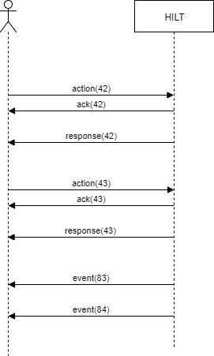
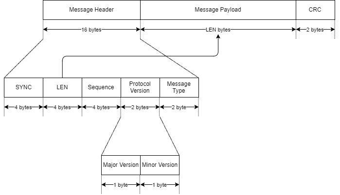
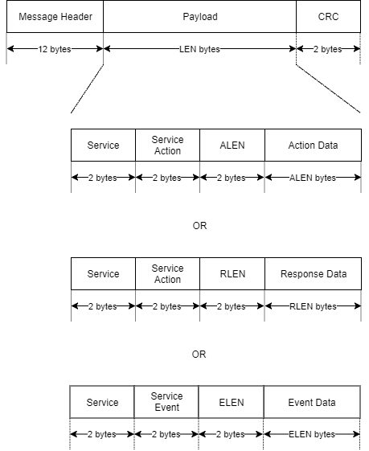
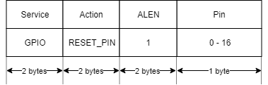
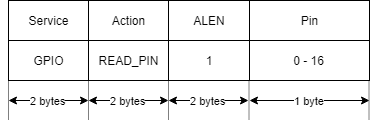
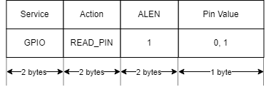
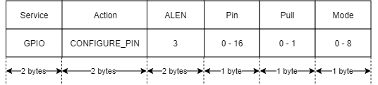

# HILT communication protocol
## Message flow

HILT has a simple straight forward message flow. All communication with HILT is asynchronous.
The protocol defines several types of messages:
* action
* response
* event
* acknowledge

An action has a unique sequence number and is acknowledged with the same
sequence number. When the action requires a response the response is given with the same 
sequence number. HILT also send events. These events have a unique identifier
that indicates what the event is about.

The physical format of the messages is described in the following sections.

## Message

A frame consists of a message header, a message payload and a CRC.

**SYNC:** 4 byte ASCII representation of "hilt".

**LEN:** Payload length in bytes.

**Sequence:** A sequence number for the frame. It shall be incremented for each new frame that is sent. It shall wrap around from 0xFFFFFFFF to 0x00000000. 

**Protocol Version:** A field combining the fields Major Version and Minor Version.

**Major Version:** The major version number of the hilt protocol.

**Minor Version:** The minor version number of the hilt protocol.

**Message Type:** The type of message:

| value | message type |
| ----- | ------------ |
| 0     | action       |
| 1     | response     |
| 2     | event        |
| 3     | acknowledge  |

**CRC:** CRC16 with polynomial "xyz" calculated over the header + payload.

## Message payload

The payload of a message is the same for an action, response and an event.
For an acknowledge the payload is empty.

**Service:** The service field is used to route the message to the correct service.
It is also used in the events to indicate from which service send the event.

**Service Action:** The action requested from the service. In the response it indicates
 for which action is this response.  

**Service Event:** The event that was sent from a service.

**ALEN:** The length of the action data.

**RLEN:** The length of the response data.

**ELEN:** The length of the event data.

## GPIO Messages
GPIO message are meant for the GPIO service.

### GPIO set pin

### GPIO reset pin

### GPIO read pin

### GPIO configure pin

## I2C Messages
I2C message are meant for the I2C service.

### Write register

### Read register

### Configure I2C bus
